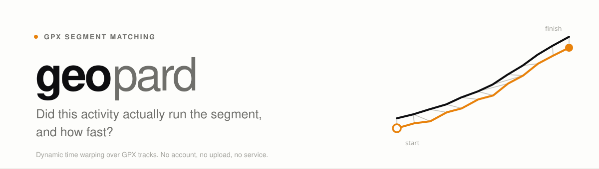
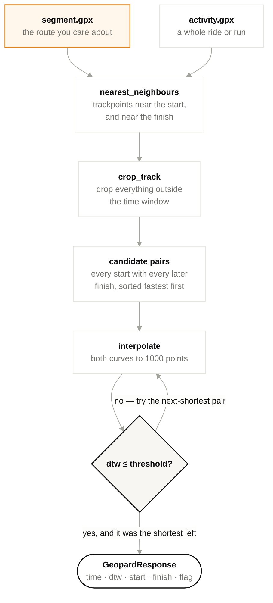
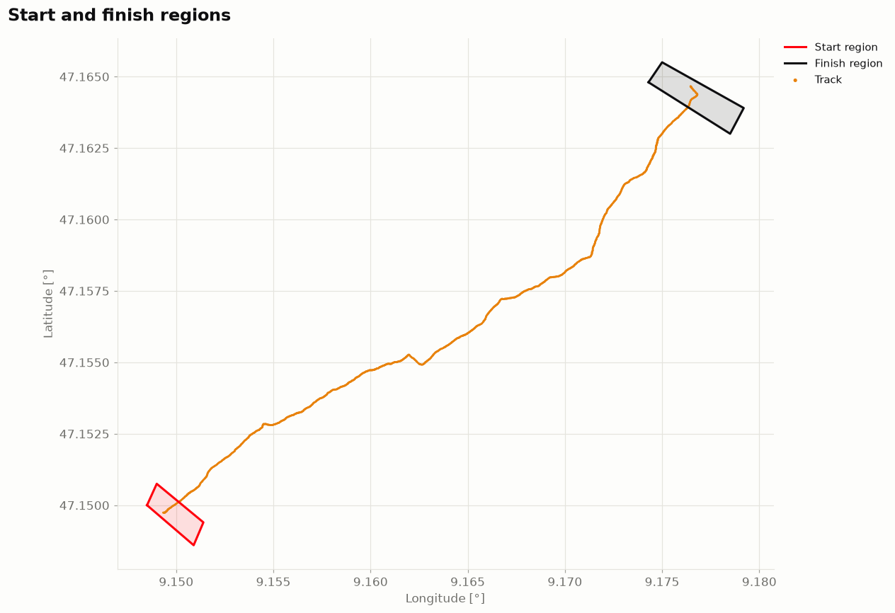
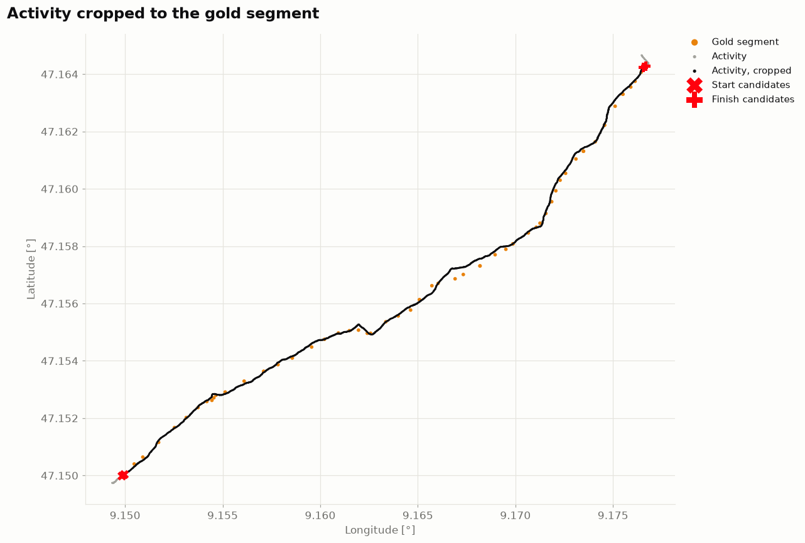
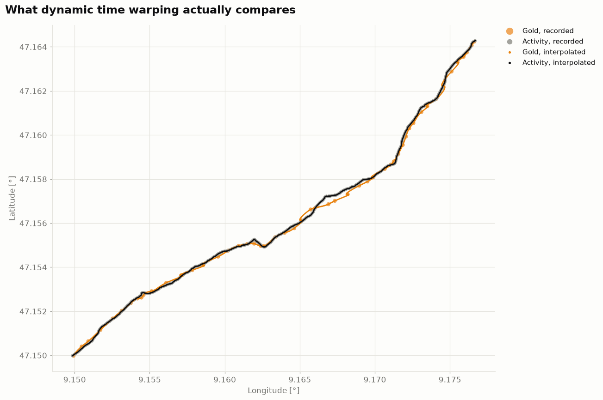

<picture>
  <source media="(prefers-color-scheme: dark)" srcset="docs/assets/banner-dark.svg">
  
</picture>

[](https://github.com/danielvogler/geopard/actions/workflows/ci.yml)
[](https://pypi.org/project/geopard/)
[](./LICENSE)
[](https://www.python.org/downloads/)
[](https://docs.astral.sh/uv/)
[](https://docs.astral.sh/ruff/)
[](https://mypy-lang.org/)
[](https://pre-commit.com/)

---

## Start here

```bash
pip install geopard
```

```python
import geopard

gp = geopard.Geopard()
response = gp.dtw_match("segment.gpx", "activity.gpx")

if response.is_success():
    print(response.time)  # 0:25:34
    print(response.dtw)  # 0.0965
```

That is the whole interface. Two files in, one answer out: **did this activity
cover that segment, and if so, how quickly.**

Working with a coding agent? Point it at **[AGENTS.md](./AGENTS.md)** — it
covers using the library (§A) and changing it (§B).

---

## What it does

You have a *segment*: a stretch of route you care about, as a GPX file. And you
have an *activity*: a recorded ride or run, usually much longer, that may or may
not have covered that segment — possibly more than once, possibly with a warm-up
loop through the start.

geopard answers whether it did, and returns the **fastest** time on it.

**Overlapping start and finish points are the hard part.** A start line is not a
point, it is every trackpoint within a few metres of one, and so is the finish.
Pair each candidate start with each candidate finish and you get dozens of
plausible segment attempts inside one activity. geopard tests them **shortest
first** and stops at the first one that really matches, so the answer is the best
time actually run — not merely one of the times that would have qualified.

**Matching is by shape, not by proximity.** Two tracks are resampled to the same
length and compared with [dynamic time
warping](https://en.wikipedia.org/wiki/Dynamic_time_warping), which aligns them
point by point while allowing either to stretch. That is what lets a slow climb
and a fast one register as the same route, while a shortcut that skips a
switchback does not — even though it passes through both the start and the
finish.

**Nothing leaves your machine.** It is a library that reads two files. No
account, no upload, no service to be discontinued.

---

## How a match works



The loop is the point. Candidates are warped in ascending order of elapsed time,
so the search can stop the moment one matches — every remaining pair is slower by
construction.

---

## Reading the result

`dtw_match` **never raises** for a match that simply did not happen. An activity
that never went near the segment is an ordinary outcome, not an error, so it
comes back as a response you can branch on:

```python
response = gp.dtw_match(segment, activity)

response.is_success()  # True for flags 2 and 1
response.time  # datetime.timedelta, or None
response.dtw  # float — lower is a closer match
response.start_point  # matched trackpoint, [lat, lon, ele, time]
response.end_point  # matched trackpoint
response.match_flag  # see below
response.error  # why it could not be evaluated, or None
```

| `match_flag` | `MatchFlag` | Meaning |
|---|---|---|
| `2` | `MATCH` | Distance at or below `dtw_threshold`. A match. |
| `1` | `GREY_ZONE` | Above the threshold but within `dtw_threshold × dtw_margin_range`. The shortest such attempt is reported so **you** decide, rather than it being silently dropped. |
| `-1` | `NO_MATCH` | Candidate pairs existed; none were close enough. |
| `-2` | `NOT_EVALUATED` | Never ran — nothing near the start, or nothing near the finish. `error` says which. |

The grey zone exists because a single threshold turns a continuous measurement
into a yes/no, and the interesting cases sit right at the line — a GPS drifting
under tree cover, a diversion around roadworks. Flagging them beats guessing on
the caller's behalf.

## Tuning a match

```python
response = gp.dtw_match(
    segment,
    activity,
    radius=15,  # metres around the segment start/finish
    min_trkps=100,  # minimum trackpoints between start and finish
    dtw_threshold=0.3,  # lower is stricter
    dtw_margin_range=1.5,  # multiplier defining the grey zone
)
```

| Argument | Default | What it is for |
|---|---|---|
| `radius` | `7.0` | How close a trackpoint must come to the segment's start or finish to count as being there. Raise it for poor GPS reception or a wide start area; lower it if unrelated passes nearby are being picked up. |
| `min_trkps` | `50` | Minimum trackpoints between a candidate start and finish. Stops a start matching a finish seconds later when the two regions overlap — a lap course, or an out-and-back. |
| `dtw_threshold` | `0.2` | The line between a match and no match. |
| `dtw_margin_range` | `1.5` | How far past the threshold still counts as the grey zone. |
| `start_region`, `finish_region` | `None` | Polygons, used instead of a radius. See below. |

### Start and finish as regions, not circles

A circle around a point is the wrong shape for a finish line across a road, or a
start that spans a car park. Pass polygons instead and the radius is ignored:

```python
start = gp.create_polygon("data/csv_polygon_files/example_start_region.csv")
finish = gp.create_polygon("data/csv_polygon_files/example_finish_region.csv")

response = gp.dtw_match(segment, activity, start_region=start, finish_region=finish)
```

The CSV needs `Latitude` and `Longitude` columns, one row per corner, in order:

```csv
ID,Latitude,Longitude
1,47.15000,9.14850
2,47.14860,9.15090
3,47.14940,9.15140
4,47.15075,9.14900
```



---

## Looking at what happened

When a match is closer or further than expected, plot it:

```python
gp.plot_track_comparison("segment.gpx", "activity.gpx", radius=7)
```



The activity as recorded, the stretch the crop kept, the segment it is being
compared against, and the candidate start and finish trackpoints. Latitude and
longitude are drawn at a corrected aspect ratio — at 47°N a degree of longitude
is two-thirds of a degree of latitude, and a raw scatter squashes the route until
a good match looks like a bad one.



The second figure is the one worth reading when a number surprises you: both
tracks after resampling, which is what dynamic time warping actually sees.

Figures follow a single palette, applied through a context manager, so importing
geopard never changes how the rest of your plots look:

```python
from geopard.plotting import style
import matplotlib.pyplot as plt

with plt.rc_context(style()):
    ...
```

---

## The pipeline, individually

Every stage is a plain function you can call on its own, and each lives in its
own module:

| Call | Module | What it does |
|---|---|---|
| `gpx_loading` | [`geopard.gpx`](./src/geopard/gpx.py) | GPX file → `(4, n)` array of latitude, longitude, elevation, time. Drops stationary repeats. |
| `spheroid_point_distance` | [`geopard.geodesy`](./src/geopard/geodesy.py) | Haversine distance in metres between two coordinates. |
| `nearest_neighbours` | [`geopard.selection`](./src/geopard/selection.py) | Trackpoints within a radius, or inside a polygon. Collapses each run to its edges. |
| `gpx_track_crop` | [`geopard.selection`](./src/geopard/selection.py) | Trims an activity to the time window that could hold the segment. |
| `interpolate` | [`geopard.interpolation`](./src/geopard/interpolation.py) | Spline-resamples a track to 1000 equidistant points. |
| `acm` | [`geopard.dtw`](./src/geopard/dtw.py) | Accumulated cost matrix, after Müller (2007) Theorem 4.3. |
| `dtw_computation` | [`geopard.dtw`](./src/geopard/dtw.py) | One stretch of activity against the interpolated segment. |
| `create_polygon` | [`geopard.regions`](./src/geopard/regions.py) | CSV of corners → Shapely polygon. |
| `dtw_match` | [`geopard.matching`](./src/geopard/matching.py) | All of the above, in order. |

```python
from geopard.gpx import load_track
from geopard.selection import nearest_neighbours

track = load_track("activity.gpx")
points, indices = nearest_neighbours(track, centroid=[47.15, 9.15], radius=10)
```

`from geopard.geopard import Geopard` — the import path from before the package
had an `__init__` — still works and is covered by a test.

---

## Reproducibility

Interpolation jitters each coordinate by up to 1e-7 degrees, about a centimetre,
because the spline solver cannot fit through two identical points. That is the
one stochastic step in the library, and it moves a warping distance in the fourth
decimal between runs. Elapsed times, flags and matched trackpoints do not move at
all.

Pin it when you need a bit-identical number:

```python
import numpy as np

np.random.seed(1234)  # pins a whole pipeline

from geopard.interpolation import interpolate

interpolate(track, seed=1234)  # or pin one call, leaving your own RNG alone
```

---

## Running the examples

The repository ships two real segments with matching activities — a Zurich
marathon and a climb in Liechtenstein — and the tests assert against measured
results on both.

```bash
make setup                     # venv, dependencies, git hooks
make match                     # match the shipped example, and plot it
make plots                     # cropping and interpolation figures
```

```bash
make match GOLD=data/gpx_files/green_marathon_segment.gpx \
           ACTIVITY=data/gpx_files/green_marathon_activity_4_15_17.gpx \
           RADIUS=20
```

## Development

```bash
make check       # lint, format, types, tests — what CI runs
make coverage    # the suite with a coverage report
make help        # every target
```

The test suite is a **benchmark, not a smoke test**. Every time, flag and
trackpoint in `tests/test_matching.py` was measured against the shipped tracks
and is asserted exactly; only the warping distance carries a tolerance, sized
from the observed run-to-run spread. That is what made it safe to restructure the
library, upgrade Shapely across a major version, and know that nothing moved.

## Scope and limits

- Reads GPX. Latitude, longitude and time are required; elevation is optional and
  unused.
- Matching is two-dimensional. Elevation does not enter the distance, so a track
  that follows the same ground plan on a different level matches.
- The accumulated cost matrix is quadratic in the interpolation count and runs in
  Python, which makes it the slowest step by a wide margin — roughly a second per
  candidate pair. Fine for an activity, worth thinking about for a season.
- Distances are great-circle on a sphere of mean Earth radius, which is accurate
  to about 0.5% — far below GPS error at these scales.

## Further reading

- **[AGENTS.md](./AGENTS.md)** — the source of truth: using the library, and
  changing it
- **[docs/architecture.md](./docs/architecture.md)** — why it is shaped this way
- **[CHANGELOG.md](./CHANGELOG.md)** — release history
- **[SECURITY.md](./SECURITY.md)** — reporting a vulnerability

## Citation

geopard implements the accumulated cost matrix of:

> Müller, Meinard. *Information Retrieval for Music and Motion*. Springer, 2007.
> [doi:10.1007/978-3-540-74048-3](https://doi.org/10.1007/978-3-540-74048-3)

## License

[MIT](./LICENSE) — Daniel Vogler, Sebastian de Castelberg.
